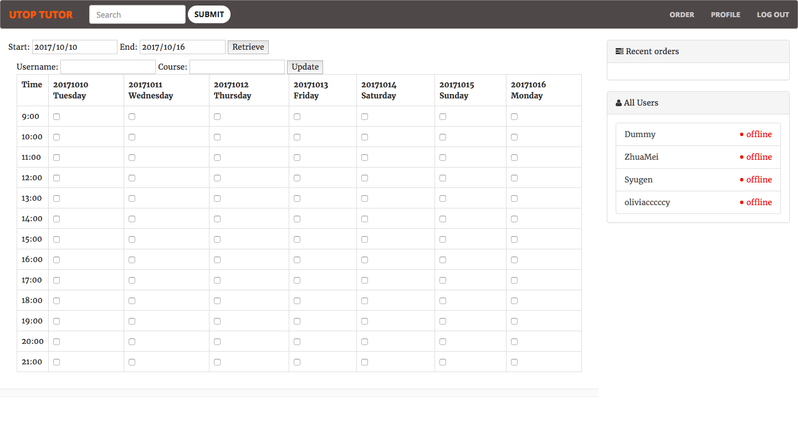

# UTop Tutor Server (V2 - Node.js)
## Abstract
Designed for UTop Tutor, an organization that offers tutoring services for students in UofT. Users can log in and make appointments with tutors. In this version, our solution stack is Node.js + Express + MongoDB, i.e. MEAN stack but without Angular; instead, some frontend jobs are done at the backend.
## Getting Started
To run this website on your localhost:
### Prerequisites
* [Node.js](https://nodejs.org/en/).
### Installing
First, install all dependencies using `npm` command.
```
npm install
```
Then, to start MongoDB, run
```
mongod --fork --logpath mongodb.log --dbpath=$PWD/data --config /etc/mongodb.conf
```
If you are running for the first time, or you want to reload the initial database, run
```
chmod +x clean_db.sh
./clean_db.sh
```
Then, to start the server, run
```
node utopNodeJs.js
```
Now, the server is listening on `localhost:3000`.
## Develop
For developers, it might be easier to test by running the website using `nodemon`. If you haven't installed it, run
```
npm install -g nodemon
```
Then, to start the server, run
```
nodemon utopNodeJs.js -e js,html,css
```
The server will restart automatically if any JavaScript, HTML, or CSS has changed.

## Preview
### Index page

### Video information page

## License
[MIT](LICENSE)
